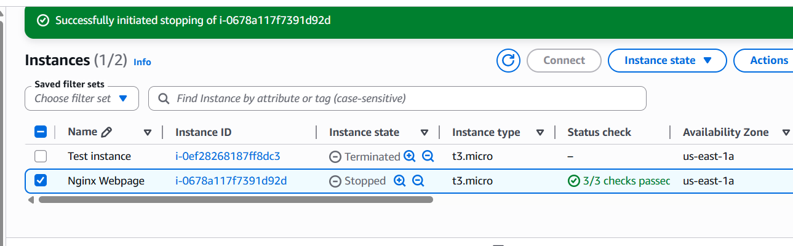
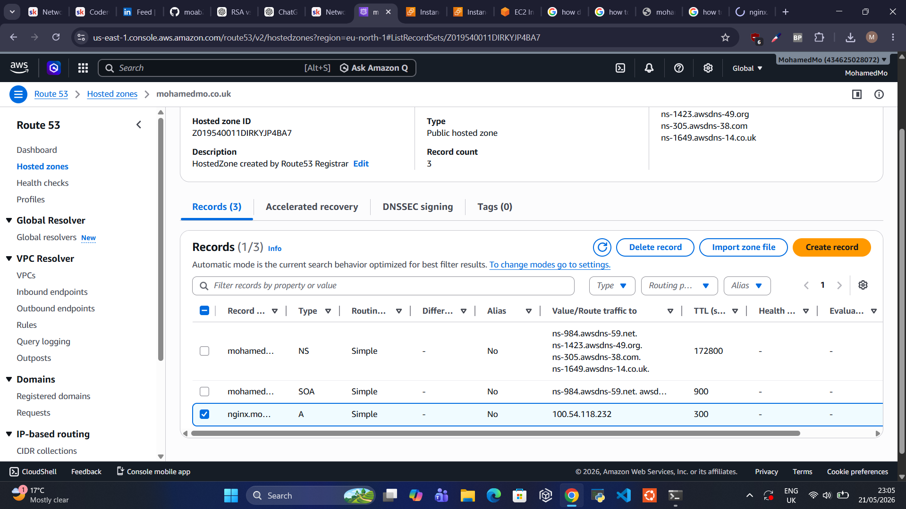
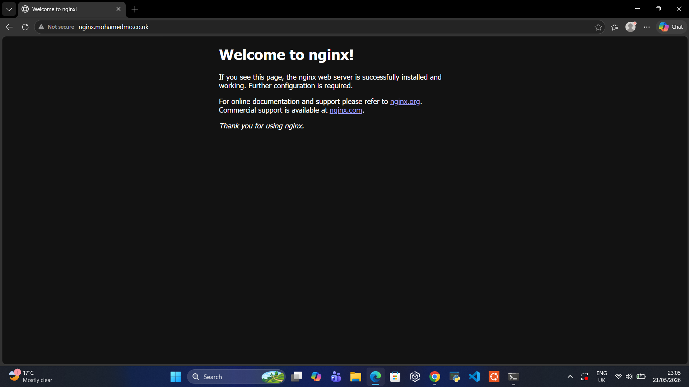

# Networking Project – Domain + NGINX Hosting

## Overview
This project was part of my networking learning journey.

The goal was to understand how websites become accessible on the internet by connecting:

- A custom domain
- A cloud server
- DNS records
- A web server (NGINX)

At the end of the project, I successfully hosted a live webpage using my own domain.

## What I Learned

- How domains connect to servers
- Basic DNS configuration
- How cloud servers work
- How websites are hosted online
- Basic troubleshooting for connectivity issues

## Project Tasks Completed

✅ Bought a custom domain

✅ Launched an AWS EC2 instance

✅ Installed and ran NGINX

✅ Configured DNS using an A record

✅ Connected my domain to the server

✅ Successfully loaded the NGINX webpage through my domain

## Tools & Services Used

### Cloud Infrastructure Services
- AWS EC2 – Virtual server hosting for deploying the website
- Route 53 / Cloudflare – DNS management and domain-to-IP mapping
- Domain Registrar – Purchased and managed the custom domain

### Web Server
- NGINX – Web server used to serve the website over HTTP

### Operating System & Access
- Linux (Ubuntu) – Operating system running on the EC2 instance
- SSH – Secure remote access to configure and manage the server

## Screenshots

### EC2 Instance Running

### DNS Configuration

### NGINX Page Loading From Custom Domain

## Key Takeaway

This project helped me understand what happens behind the scenes when someone types a website address into a browser.